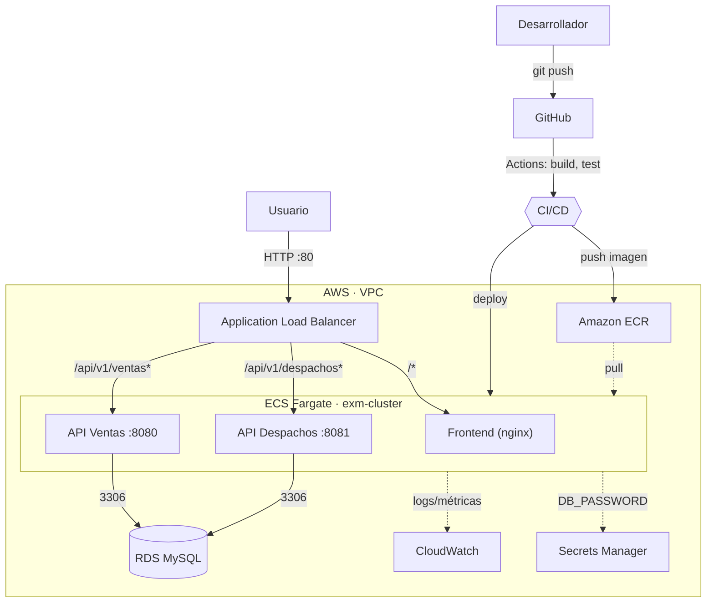

# ExamenDevOps

Evaluación Final Transversal — **ISY1101 Introducción a Herramientas DevOps**.

Automatización del ciclo **CI/CD** de una plataforma de gestión de despachos
(frontend + dos APIs + base de datos relacional), contenerizada con Docker,
con pipeline en **GitHub Actions** y despliegue orquestado en **AWS ECS Fargate**.

## Arquitectura



El ALB enruta por *path*: `/api/v1/ventas*` va al servicio de Ventas,
`/api/v1/despachos*` al de Despachos y cualquier otra ruta al frontend. Los dos
backends comparten la base de datos MySQL en RDS.

## Stack

| Componente | Tecnología |
| --- | --- |
| Frontend | React 18 + Vite, servido con nginx |
| Backend Ventas | Spring Boot 3.4 (Java 17), puerto 8080 |
| Backend Despachos | Spring Boot 3.4 (Java 17), puerto 8081 |
| Base de datos | MySQL 8 (RDS en la nube, contenedor en local) |
| Contenedores | Docker (multietapa, alpine, usuario no-root) |
| Orquestación local | docker-compose |
| CI/CD | GitHub Actions |
| Registro de imágenes | Amazon ECR |
| Nube | AWS: ECS Fargate, ALB, RDS, CloudWatch, Secrets Manager, IAM |

## Estructura del repositorio

```
.
├── frontend/                 # React + Vite (nginx en runtime)
├── backend/
│   ├── ventas/               # API de ventas (Spring Boot)
│   └── despachos/            # API de despachos (Spring Boot)
├── infra/                    # scripts de infraestructura (AWS CLI)
├── docs/                     # informe y diagramas
├── docker-compose.yml        # orquestación local
└── .github/workflows/        # pipelines CI (ci.yml) y CD (deploy.yml)
```

## Ejecución local

Requiere Docker. Copiar el archivo de variables y levantar el stack:

```bash
cp .env.example .env          # ajustar credenciales locales si se quiere
docker compose up -d --build
```

Servicios disponibles:

| Servicio | URL local |
| --- | --- |
| Frontend | http://localhost:3000 |
| API Ventas | http://localhost:8080/api/v1/ventas |
| API Despachos | http://localhost:8081/api/v1/despachos |
| MySQL | localhost:3306 |

Para bajar todo: `docker compose down` (o `down -v` para borrar también los datos).

## CI/CD

Dos workflows en `.github/workflows/`:

- **`ci.yml`** — en cada Pull Request hacia `dev`/`main` y en push a `dev`:
  corre los tests de ambos backends (perfil H2, sin BD externa) y compila el
  frontend.
- **`deploy.yml`** — en push a `main` (o manual): construye las tres imágenes,
  las publica en ECR con tag por commit (`${GITHUB_SHA::7}`) y `latest`,
  registra una nueva revisión de task definition y actualiza los servicios de
  ECS esperando su estabilidad.

El deploy necesita los secrets `AWS_ACCESS_KEY_ID`, `AWS_SECRET_ACCESS_KEY` y
`AWS_SESSION_TOKEN` (credenciales temporales del laboratorio).

## Infraestructura en AWS

Los scripts de `infra/` aprovisionan toda la infraestructura de forma
reproducible con la CLI de AWS (ver [`infra/README.md`](infra/README.md)):

```bash
cd infra
export AWS_PROFILE=exm
./provision.sh     # crea ECR, red, RDS, ECS, ALB y servicios
./teardown.sh      # baja todo
```

## Estrategia de ramas

Flujo de tres niveles vía Pull Request:

```
feature/*  →  dev  (integración)  →  main  (estable / producción)
```

Todo cambio entra por una rama de trabajo y sube vía PR; nunca se commitea
directo a `main`. La integración a `main` dispara el despliegue a producción.

## Equipo

- Najeeb Escobar Pérez
- _(compañero/a de dupla)_
